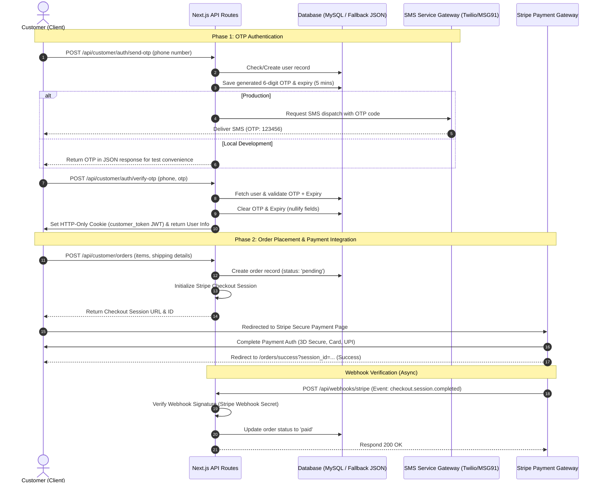

# Kashmiri Organic - Mobile OTP Verification & Payment Integration Manual (`apiinfo.md`)

This document provides a technical brief on **Mobile OTP Authentication** and **Stripe Payment Gateway Integration** during order placement for the Kashmiri Organic platform. It details the API endpoints, workflow sequences, database schemas, and integration instructions to transition from mock/simulated behaviors to production-ready systems.

---

## 1. Architectural Architecture & Workflows

### System Sequence Diagram



---

## 2. Phase 1: Mobile OTP Verification

The platform supports passwordless customer authentication using email or 10-digit mobile numbers. Under the hood, this uses JSON Web Tokens (JWT) stored in HTTP-Only cookies to manage secure customer sessions.

### API Specifications

#### 1. Generate & Send OTP
* **Endpoint:** `POST /api/customer/auth/send-otp`
* **Content-Type:** `application/json`
* **Request Payload:**
```json
{
  "identifier": "9876543210" 
}
```
*(Alternatively, accepts an email address e.g. `customer@domain.com`)*

* **Database Actions:**
  * Checks if a user with the specified phone number exists in the `users` table.
  * If the user **does not exist**, a new user record is inserted with `role = 'customer'`, an empty password hash, and the phone number populated.
  * Generates a 6-digit numeric token (cryptographically secure or high-entropy random).
  * Sets the `otp` column to the generated code and the `otp_expiry` to 5 minutes in the future (`now() + 5 minutes`).
* **Response Payload (Simulated/Local Dev):**
```json
{
  "success": true,
  "message": "Secure OTP generated.",
  "otp": "123456"
}
```
> [!IMPORTANT]
> In production environments, the `"otp"` field must **never** be exposed in the JSON response payload. It should be removed, and the code must be dispatched via a secure SMS API provider.

---

#### 2. Verify OTP & Establish Session
* **Endpoint:** `POST /api/customer/auth/verify-otp`
* **Content-Type:** `application/json`
* **Request Payload:**
```json
{
  "identifier": "9876543210",
  "otp": "123456"
}
```
* **API Validation Steps:**
  1. Fetch the user profile by the identifier (phone/email).
  2. Verify that `otp` and `otp_expiry` exist.
  3. Match the submitted OTP with the stored OTP.
  4. Ensure `otp_expiry` has not passed.
  5. If validation passes, nullify `otp` and `otp_expiry` columns in the database for the user.
  6. Sign a JWT token containing: `{ id, phone, name, email, role: 'customer' }` using `process.env.JWT_SECRET`.
  7. Set the JWT token in a cookie named `customer_token` with the following attributes:
     * `httpOnly: true` (Prevents XSS attacks from reading the token)
     * `secure: true` (Only transmitted over HTTPS)
     * `sameSite: 'lax'` (Provides CSRF protection)
     * `maxAge: 604800` (7 days duration)
* **Response Payload:**
```json
{
  "success": true,
  "message": "Authentication successful.",
  "user": {
    "id": 4,
    "phone": "9876543210",
    "name": "Kishan Kumar",
    "email": "kishan@example.com",
    "role": "customer"
  }
}
```

---

### Production SMS Gateway Integration

To replace the simulated `console.log` with a real SMS service (e.g., **Twilio** or **MSG91**), implement the following setup inside `src/app/api/customer/auth/send-otp/route.ts`:

#### Option A: Twilio Integration
```typescript
import twilio from 'twilio';

const accountSid = process.env.TWILIO_ACCOUNT_SID;
const authToken = process.env.TWILIO_AUTH_TOKEN;
const twilioClient = twilio(accountSid, authToken);

async function sendSMSViaTwilio(phoneNumber: string, otpCode: string) {
  // Ensure phone number includes country code, e.g., +919876543210
  const formattedPhone = phoneNumber.startsWith('+') ? phoneNumber : `+91${phoneNumber}`;
  
  await twilioClient.messages.create({
    body: `Your Kashmiri Organic verification code is ${otpCode}. It is valid for 5 minutes. Please do not share this code.`,
    from: process.env.TWILIO_PHONE_NUMBER, // e.g. +1234567890
    to: formattedPhone
  });
}
```

#### Option B: MSG91 Integration (Recommended for Indian Numbers)
```typescript
async function sendSMSViaMSG91(phoneNumber: string, otpCode: string) {
  const cleanNumber = phoneNumber.replace(/\D/g, ''); // strip any + or non-numeric chars
  const recipient = cleanNumber.length === 10 ? `91${cleanNumber}` : cleanNumber;

  const response = await fetch('https://api.msg91.com/api/v5/otp', {
    method: 'POST',
    headers: {
      'authkey': process.env.MSG91_AUTH_KEY!,
      'Content-Type': 'application/json'
    },
    body: JSON.stringify({
      template_id: process.env.MSG91_TEMPLATE_ID!, // Approved DLT template ID
      mobile: recipient,
      otp: otpCode
    })
  });

  if (!response.ok) {
    throw new Error('Failed to dispatch SMS through MSG91');
  }
}
```

---

## 3. Phase 2: Payment Integration on Order Place

When placing an order, rather than immediately confirming it as `'paid'` using static simulations, the checkout flow initiates a Stripe Checkout Session, processes payments on Stripe's secure infrastructure, and transitions the order state asynchronously via Webhooks.

### Payment Integration Workflow

1. **Order Initiation:**
   When the user submits the checkout form in the frontend, a payload containing cart items, total price, and shipping details is sent to `POST /api/customer/orders`.
2. **Database Draft Creation:**
   The backend creates an order record in the database with `status = 'pending'`. The generated order ID (e.g., `KO-ORD-2026-4832`) is tied to the order.
3. **Session Creation:**
   The backend makes a secure server-to-server API call to Stripe to create a **Checkout Session**. The Stripe session includes:
   * **Line Items:** Cart items formatted with name, image, and price in cents (`price * 100`).
   * **Metadata:** The internal `orderId` is stored in Stripe metadata to reconcile the order status later.
   * **Redirect URLs:** Configured callback routes:
     * `success_url`: Redirects the user to `/orders/success?session_id={CHECKOUT_SESSION_ID}&order=orderId` on success.
     * `cancel_url`: Redirects the user to `/cart?error=payment_cancelled` if they abort.
4. **Redirection:**
   The API handler returns the Stripe Checkout URL. The frontend redirects the user’s window to Stripe.
5. **Secure Authentication & Payment:**
   The customer pays on Stripe's secure PCI-compliant page (supporting Credit/Debit cards, Apple Pay, Google Pay, and local options like UPI if configured).
6. **Webhook Reconciliation:**
   Stripe sends an asynchronous POST request to the application's webhook listener (`/api/webhooks/stripe`) once the payment is completed. The status in the database is then updated to `'paid'`.

---

### Database Schema for Orders

To manage these state transitions properly, ensure your database table matches this definition:

```sql
CREATE TABLE IF NOT EXISTS `orders` (
  `id` VARCHAR(100) PRIMARY KEY,
  `user_phone` VARCHAR(100) NOT NULL,
  `user_name` VARCHAR(255) NOT NULL,
  `user_email` VARCHAR(255) NULL,
  `items` LONGTEXT NOT NULL,                    -- JSON string containing cart details
  `total_amount` DECIMAL(10,2) NOT NULL,
  `status` VARCHAR(50) DEFAULT 'pending',       -- States: pending, paid, processing, shipped, delivered, cancelled
  `shipping_address` TEXT NOT NULL,             -- JSON string containing address details
  `payment_method` VARCHAR(100) NOT NULL,       -- e.g., 'stripe_card', 'upi'
  `created_at` VARCHAR(100) NOT NULL,
  `coupon_code` VARCHAR(100) NULL,
  `discount_amount` DECIMAL(10,2) DEFAULT 0.00,
  `stripe_session_id` VARCHAR(255) NULL         -- For transaction reconciliation
) ENGINE=InnoDB DEFAULT CHARSET=utf8mb4 COLLATE=utf8mb4_unicode_ci;
```

---

### Stripe Checkout Backend API Endpoint

* **Endpoint:** `POST /api/checkout`
* **Content-Type:** `application/json`
* **Route Implementation (`src/app/api/checkout/route.ts`):**

```typescript
import { NextRequest, NextResponse } from 'next/server';
import Stripe from 'stripe';
import { executeQuery } from '@/lib/db';

const stripe = new Stripe(process.env.STRIPE_SECRET_KEY!, {
  apiVersion: '2025-01-27' as any,
});

export async function POST(req: NextRequest) {
  try {
    const { items, orderId, customerEmail, shippingAddress, totalAmount, userPhone, userName } = await req.json();

    // 1. Create a Pending Order in the Database first
    const orderSql = `
      INSERT INTO orders (id, user_phone, user_name, user_email, items, total_amount, status, shipping_address, payment_method, created_at)
      VALUES (?, ?, ?, ?, ?, ?, ?, ?, ?, ?)
    `;
    await executeQuery(orderSql, [
      orderId,
      userPhone,
      userName,
      customerEmail || '',
      JSON.stringify(items),
      totalAmount,
      'pending', // Mark as pending until webhook confirms payment
      JSON.stringify(shippingAddress),
      'stripe_card',
      new Date().toISOString()
    ]);

    // 2. Map items to Stripe checkout line items format
    const lineItems = items.map((item: any) => ({
      price_data: {
        currency: 'inr', // Or 'usd' depending on configuration
        product_data: {
          name: item.name,
          images: item.image_url ? [item.image_url] : [],
        },
        unit_amount: Math.round(item.price * 100), // Stripe expects amounts in cents/paise
      },
      quantity: item.quantity,
    }));

    // 3. Create Checkout Session on Stripe
    const session = await stripe.checkout.sessions.create({
      payment_method_types: ['card'], // Add 'upi' or other options if needed
      line_items: lineItems,
      mode: 'payment',
      success_url: `${process.env.NEXT_PUBLIC_APP_URL}/orders/success?session_id={CHECKOUT_SESSION_ID}&order=${orderId}`,
      cancel_url: `${process.env.NEXT_PUBLIC_APP_URL}/cart?error=payment_cancelled`,
      metadata: {
        orderId: orderId,
      },
      customer_email: customerEmail || undefined,
    });

    // 4. Update order with Stripe Session ID for tracking
    const updateSessionSql = 'UPDATE orders SET stripe_session_id = ? WHERE id = ?';
    await executeQuery(updateSessionSql, [session.id, orderId]);

    return NextResponse.json({ id: session.id, url: session.url });
  } catch (error: any) {
    console.error('Stripe Checkout Error:', error);
    return NextResponse.json({ error: error.message }, { status: 500 });
  }
}
```

---

### Stripe Webhook Handler Endpoint

Stripe webhooks bypass client-side code and guarantee that the order is updated even if the user closes their browser before returning to the success page.

* **Endpoint:** `POST /api/webhooks/stripe`
* **Route Implementation (`src/app/api/webhooks/stripe/route.ts`):**

```typescript
import { NextRequest, NextResponse } from 'next/server';
import Stripe from 'stripe';
import { executeQuery } from '@/lib/db';

const stripe = new Stripe(process.env.STRIPE_SECRET_KEY!, {
  apiVersion: '2025-01-27' as any,
});

export async function POST(req: NextRequest) {
  const payload = await req.text();
  const signature = req.headers.get('stripe-signature')!;
  const webhookSecret = process.env.STRIPE_WEBHOOK_SECRET!;

  let event: Stripe.Event;

  try {
    // Cryptographically verify webhook signature to prevent spoofing
    event = stripe.webhooks.constructEvent(payload, signature, webhookSecret);
  } catch (err: any) {
    console.error('Webhook signature validation failed:', err.message);
    return NextResponse.json({ error: `Signature verification failed: ${err.message}` }, { status: 400 });
  }

  // Handle transaction confirmation event
  if (event.type === 'checkout.session.completed') {
    const session = event.data.object as Stripe.Checkout.Session;
    const orderId = session.metadata?.orderId;

    if (orderId) {
      // Update order status to 'paid' in DB
      const sql = 'UPDATE orders SET status = ? WHERE id = ?';
      await executeQuery(sql, ['paid', orderId]);
      
      console.log(`[Webhook success] Order ${orderId} marked as PAID.`);
      
      // OPTIONAL: Trigger email / SMS notification dispatch here
    }
  }

  return NextResponse.json({ received: true });
}
```

---

## 4. Key Security Practices

1. **Webhook Validation:**
   Always verify the webhook payload using the `stripe.webhooks.constructEvent` method. Do not trust the payload properties without verifying the signature against the `STRIPE_WEBHOOK_SECRET`.
2. **HTTP-Only Cookies:**
   Store authentication credentials (`customer_token`) strictly inside HTTP-Only cookies. Avoid local storage for JWT tokens to prevent Cross-Site Scripting (XSS) theft.
3. **Price Validation:**
   Do **not** trust prices sent by the client frontend inside the request payload. In a production pipeline, fetch the products from the database by their IDs to calculate total checkout prices, preventing pricing manipulation.
4. **Rate Limiting:**
   Implement strict rate limiting on `/api/customer/auth/send-otp` to avoid denial of service and costly cellular carrier bills. Allow at most 1 OTP dispatch per mobile number every 60 seconds.

---

## 5. Deployment Environment Setup

Configure these variables inside your production environment file (`.env`):

```env
# Database Credentials
DB_HOST=127.0.0.1
DB_USER=your_db_username
DB_PASSWORD=your_db_password
DB_NAME=your_db_name
DB_PORT=3306

# Authentication Key
JWT_SECRET=use_a_high_entropy_random_32_character_string

# App URL Configuration
NEXT_PUBLIC_APP_URL=https://kashmiri-organic.com

# Stripe Integration Keys (Obtained from Dashboard)
STRIPE_SECRET_KEY=sk_live_51...
NEXT_PUBLIC_STRIPE_PUBLISHABLE_KEY=pk_live_51...
STRIPE_WEBHOOK_SECRET=whsec_...

# SMS Gateway Keys (E.g. Twilio / MSG91)
TWILIO_ACCOUNT_SID=AC...
TWILIO_AUTH_TOKEN=your_token
TWILIO_PHONE_NUMBER=+1234567890
```
